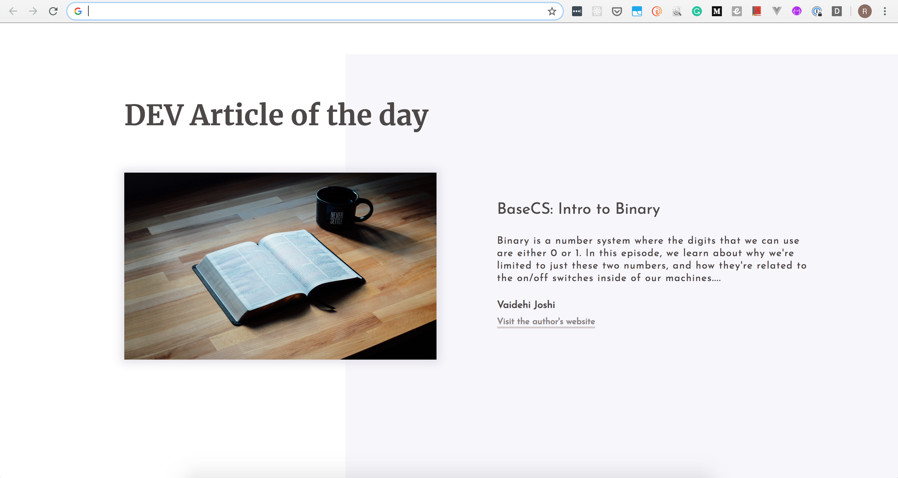

## Chrome Extension to display a DEV article everyday

This extension was build to randomly pick a dev article and display it everytime we open a new tab in Chrome browser. This world is moving so fast, and it's really hard to catch up with the blog posts, newsletters, technologies, talks and whatnot.

To leverage this "too much of learning" for some extent, I've build a chrome extension which will show up a dev article everytime you open up a new tab. So you need not have to feel guilty if you miss to check out DEV site for a day.

Now you can easily catch up with the latest DEV article everytime you open a New Tab!
There can be times when the work gets piled up and we may not be able to visit the DEV website.
With this extension, the recent DEV article is right there everytime you open a tab. You can click on the article image to read the entire article by taking you to DEV website and also will be able to visit the author's website.

A good start to stay ahead of the game!
